#sixth_semester
# Problem Solving Agent 
* Steps
	* Goal Formulation
	* Problem Formulation
	* Search
	* Execute
## Goal Formulation
The process of defining what an agent aims to achieve based on its current state and the criteria used to measure success. It enables the agent to focus on a specific objective and determine the most appropriate sequence of actions required to achieve that goal.

>[!example] Example
>* An agent is currently at A in a map. Its task is to reach location B with the shortest possible distance 
> **Current State:** Agent is at A
> **Goal:** Agent must reach B
> **Success Measure:** Minimum distance or minimum time
> **Result of goal formulation:** Agent decides to find the shortest path from A to B using an appropriate strategy.
## Problem Formulation
* *Problem Formulation* is the process of deciding what actions and states to consider, given a goal. 
* **Initial State:** The agent is at location A on the map.
* **State Space:** All possible locations (nodes) on the map that the agent can occupy. 
* **Action:** Move from the current location to any directly connected neighboring location
* **Goal Test:** The agent reaches location B.
### State Search Space (State Space)
The state search space is the set of all possible states that a problem can have, along with the paths between these states caused by valid actions. This includes every situation that the system can be in and all the ways it can move from one situation to another.
#### Components of a State Search Space
* **State:** A specific configuration of the problem.
* **Initial State:** The starting configuration.
* **Goal State:** The desired ending configuration.
* **Successor functions (actions):** Rules that move the system from one state to another. 
* **Path:** Links between states created by applying operators.
## Search
The process of looking for a sequence of actions that reaches the goal is called search. A search algorithm takes a problem as in put and returns a solution in the form of an action sequence.
A state space may be searched in two directions:
* Data Driven Search: From given data towards a Goal
* Goal Driven Search: From a goal back to data
### State Space Search Methods
* Blind/Uninformed/Brute-force Search
* Heuristic/Informed Search 
* Adversarial Search Algorithms (Game Playing)
#### Blind Uninformed Search Methods 
* Breadth First Search (BFS)
* Depth First Search (DFS)
* Iterative Deepening Search (IDS)
* Uniform Cost Search (UCS)
#### Heuristic/Informed Search 
* Best First Search 
* A* Search
#### Adversarial Search Algorithms 
* Minimax Search

### Measuring Problem-Solving Performance
We'll measure the performance of problem solving based on four factors: 
* ***Completeness*** -> Will it find a solution?
* ***Optimality*** -> Will it find the best solution?
* ***Time Complexity*** -> How long will it take?
* ***Space Complexity*** -> How much memory will it use?
## Execution Phase
Once a solution is found, the action it recommends can be carried out and is called the execution phase. 

### Blind/Uninformed/Brute-force Searches
* They do not use any information about location of the goal in the search space. 
* Explore Search Space systematically and blindly, expanding nodes until a solution is found. 
* First solution may not be optimal if more than one exist.
* Search process is represented as a search tree, where nodes correspond to states. 
* Algorithm begins at the initial state and explores the tree until it reaches a goal state. 
* Different blind search methods are distinguished by how they traverse the search tree.

#### Some Common Measurements
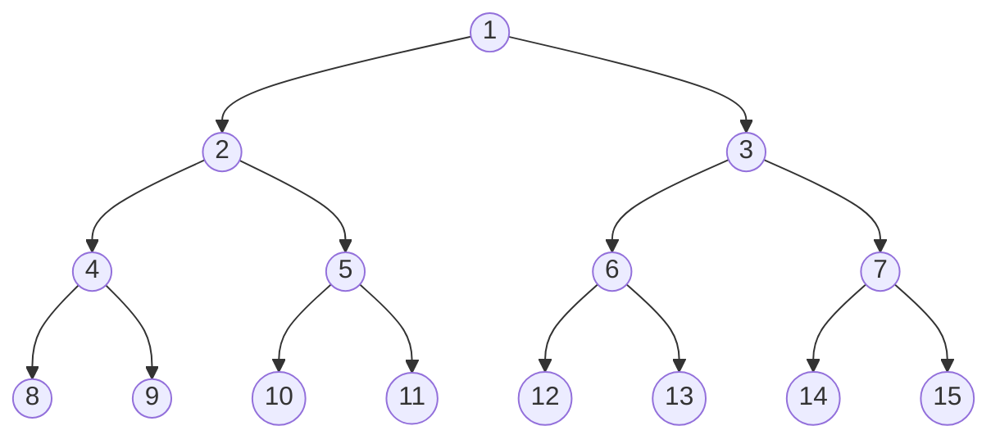
**d:** Maximum Level (3 here)
**h:** height of tree = d + 1 (4)
**b:** number of maximum children (2)


## BFS 
* Explores breadth-first (level wise). **This uses a queue or a FIFO data structure**
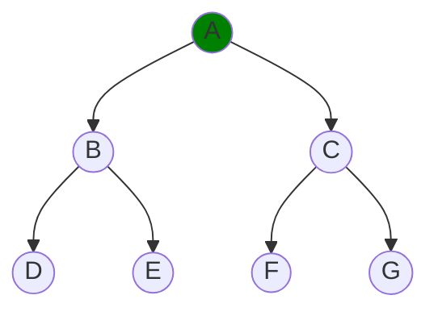
Starting from A, we move on to B then C "level-wise"

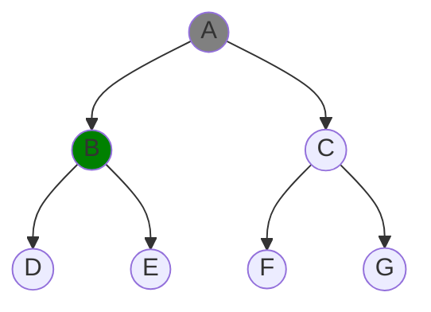
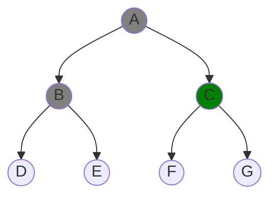
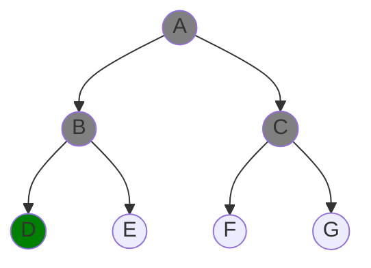
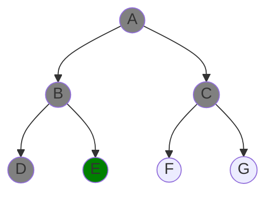
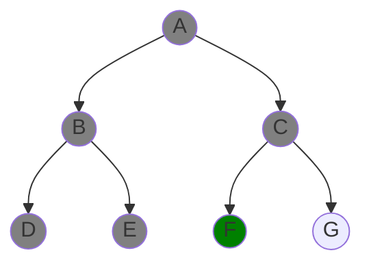
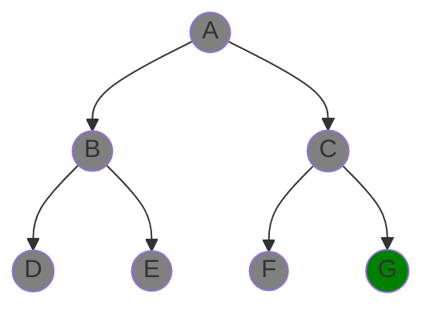
### Time Complexity
Assume a state space where every state has `b` successors. Assume solution is at depth `d`. Worst case would be to expand all but the last node at depth d

Total numbers of generated nodes = $b^1 + b^2 + \dots b^d = \boxed{O(b^d)}$

### Space Complexity
* There will be $O(b^{d-1})$ nodes in the explored set and $O(b^d)$ nodes in the frontier
* So Space Complexity becomes $\boxed{O(b^d)}$

### BFS Analysis
* Completeness: BFS is complete if b is finite.
* Time = $O(b^d)$
* Space = $O(b^d)$ (Every node is kept in memory)
* Optimality: Yes, if cost is 1 per step.
* Space is our bigger problem here as it will explode exponentially.

## DFS
* DFS explores a search space by going as deep as possible along one path before backtracking. **This uses a stack or a LIFO data structure**

Starting from A, we move on to B then D "depth-wise"


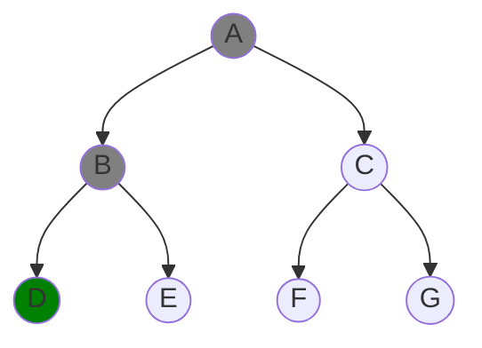
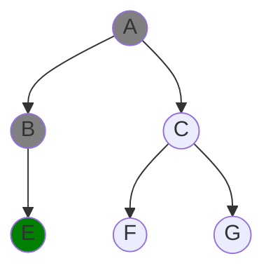
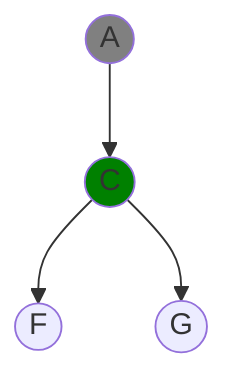
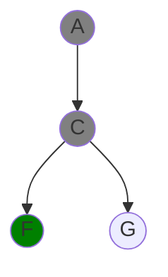


>[!important] DFS REMOVAL STRATEGY
>Whenever there's an explored node with no descendants in the frontier, we remove it from memory

### DFS Analysis
* Time Complexity = $O(b^m)$ where $m$ is maximal depth. 
* If $m$ is much larger then $d$ (depth of shallowest solution) then this time complexity is very terrible
* DFS is faster than BFS if more than one solution exist.
* Space Complexity: $O(bm)$
* ***Completeness:*** Fails in infinite-depth spaces
* ***Optimality:*** Doesn't always return the optimal solution to a problem.

## Iterative Deepening Search (IDS)
```pcode
function ITERATIVE-DEEPENING-SEARCH(problem) returns a solution, or failure
	inputs: problem, a problem
	
	for depth <- 0 to infinity do
		result <- DEPTH-LIMITED-SEARCH(problem, depth)
		if result != cutoff then return result
```
