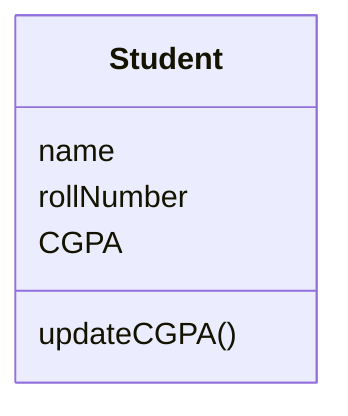
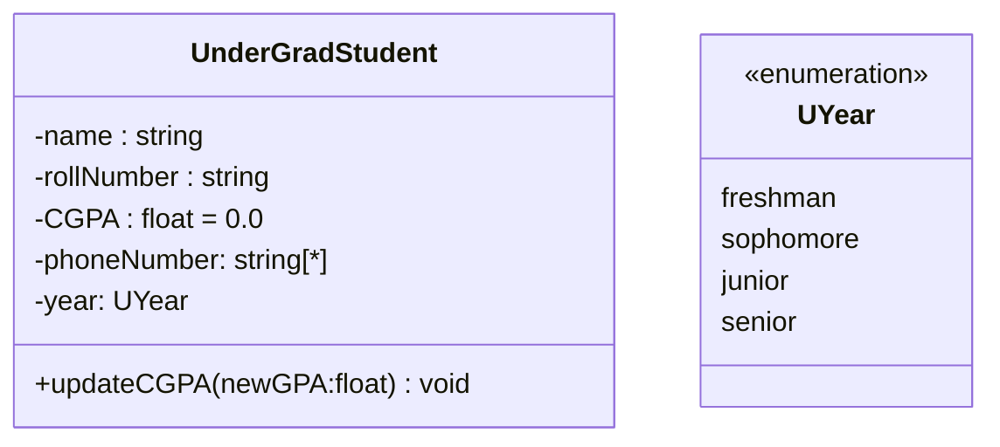
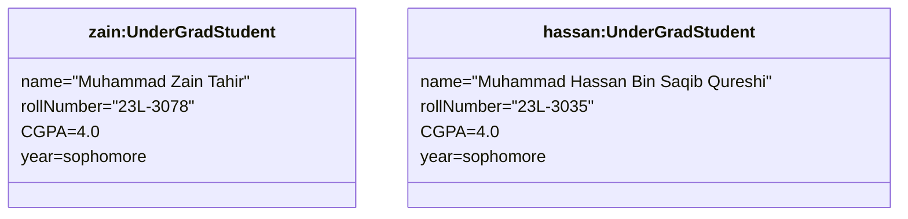

A class can have up to three compartments. First is the name, Second is the attribute, third is the operations. A Design Class Diagram has more information than Analysis Class Diagram.

(This is an ACD)
In phase 1 we will submit ACD, and then phase 2 would be DCD.

>[!caution] Symbols in Class Diagram
>-> '+' Public 
>-> '-' Private 
>-> '#' Protected (Only inherited classes can see it)
>-> '~' Package 
>* () parameters
>* [] multiplicity 
>* {} constraints

>[!caution] Conventions 
>* All class names are in upper camel case and centered. (UpperCamelCase)
>* All attributes are in lower camel case and left aligned. (lowerCamelCase), abbreviations are exempted (may be all CAP, like CGPA)
>* If third compartment is missing, then we don't have info, if it is present but empty then there are no operations. 
>* If parenthesis are present in the operation but are empty then they have no arguments, if they are not present then we do not know.

***Avoid the third compartment in the enum in above diagram. we WILL NOT make it***

This is a DCD (as it provides info about the "solution space" i.e. provides info about data types, default values etc.)

>[!error] CARDINALITY / MULTIPLICITY 
> * can be : 1,2,5, 5..17, * , 1..* etc 
> * [ 1 ] means that each student object will have only one name etc.
> * [0..1] each object either has it or doesn't have it.
> * USE ONLY TWO BLOODY DOTS, NOT THREE, NOT MORE 

***BRING LEAD PENCIL AND ERASER IN NEXT SDA CLASS.***

This DCD will be available to the programmer. This(ENUM) is like a hint for the programmer to create a drop-down or something similar for the user.

![[Class Diagrams 2025-01-29 11.08.42.excalidraw]]This is a comment box. USE FUCKING SQUARE SIDES.

### Object Diagram
A sample object diagram 

![[2025-02-07_11-09-33.png]]
*Again don't make these empty blocks.*

