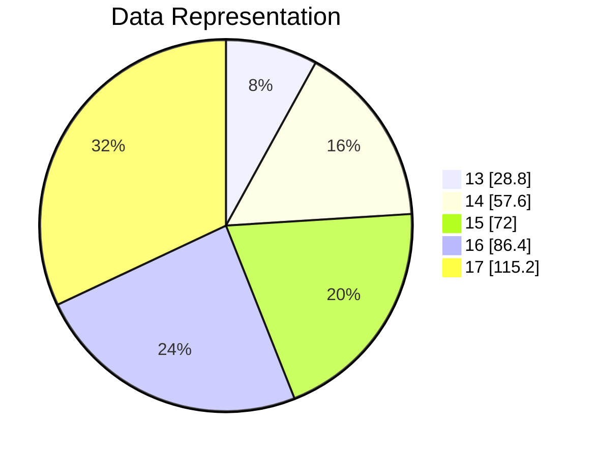

A circle has 360 degrees that must be divided amongst the data depending on their frequencies. For this purpose we calculate Relative Frequencies and then multiply by 360 to calculate number of degrees for each element. [[Relational Algebra]]

Relative Frequency = $RF$ = $\frac{F}{\sum F}$

| **X** | **F** | **RF** | **RFx360** |
| ----- | ----- | ------ | ---------- |
| 13    | 2     | .08    | 28.8       |
| 14    | 4     | .16    | 57.6       |
| 15    | 5     | .2     | 72         |
| 16    | 6     | .24    | 86.4       |
| 17    | 8     | .32    | 115.2      |
$\sum F=25$

`B = business, F = family, H=health, S=study, L=leisure`
2   
8    
12   
5   
24   
14  
11  
13  
5  
19  
8  
12  
5  
13  
4  
14  
32  
7  
19  
14  